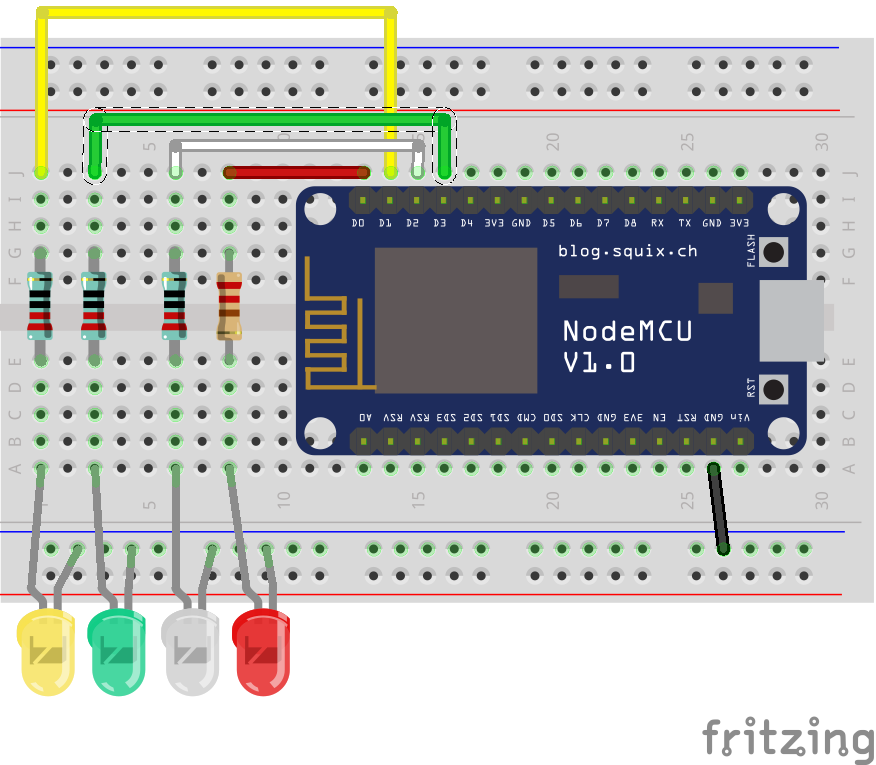

# mltrennung

## Discription 

MLtrennung is a machine learning prototype to classify litter and determine in wich bin it has to go. 


## Status

This is a work in progress.
Currently attemting to prove concept.

## Installation 

### Tested environment of the prototype 

We did only use the code on a M1 Macbook with high sierra, but it should work fine with older MacOS and Windos aswell 

### Used software 

You need to install:
- Wekinator
- Processing 
    - oscP5. library 
- Arduino IDE
    - Node MCU 1.0 software
    - OSC library by CNMAT

### Provided Code

- Trained model for wekinator 
- Videosketch to get USC packages into wekinator for processing 
- Arduino code to controll the LED

## How to use? 

### Processing videotool 

- select your camera 
```
insert number (0,1,2,3,...) to select camera, in case you have mulriple
default is 0 
line 40: > video = new Capture(this, width, height, cameras[x]); <
```

### Setting up wekinator

- apple controll bar 
    - File -> open -> select the contained model
- train 
- run 

### Setting up arduino 

- compile and upload 

## Diagrams

### Node MCU wiring



## Theoretical extentions

### Architecture 

For a commercial use we would use a Raspberrypie and Node MCU for the button, LEDs and preparing the data to be sent with TCP.
On the recieving end, in the cloud, it would be converted to UDP for compatibility reasons and the results would be interpreted by a database to determine in wich region the litter would go in wich bin. The information is sent back to the Rasp wich then sets of the right LED relative to its local trash management. 


## Code

### Arduino 

```

#ifdef ESP8266
#include <ESP8266WiFi.h>
#else
#include <WiFi.h>
#endif
#include <WiFiUdp.h>
#include <OSCMessage.h>
#include <OSCBundle.h>
#include <OSCData.h>

char ssid[] = "Jonnys iPhone Mini";          // your network SSID (name)
char pass[] = "DerHammer";                    // your network password

// A UDP instance to let us send and receive packets over UDP
WiFiUDP Udp;

const unsigned int localPort = 12000;        // local port to listen for UDP packets (here's where we send the packets)


OSCErrorCode error;

unsigned int message;

#define REST 16
#define GELBER_SACK 5
#define PAPIER 4
#define BIO 0

void setup() {
  pinMode(REST, OUTPUT);
  pinMode(GELBER_SACK, OUTPUT);
  pinMode(PAPIER, OUTPUT);
  pinMode(BIO, OUTPUT);

  Serial.begin(115200);

  // Connect to WiFi network
  Serial.println();
  Serial.println();
  Serial.print("Connecting to ");
  Serial.println(ssid);
  WiFi.begin(ssid, pass);

  while (WiFi.status() != WL_CONNECTED) {
    delay(500);
    Serial.print(".");
  }
  Serial.println("");

  Serial.println("WiFi connected");
  digitalWrite(REST, HIGH);
  digitalWrite(GELBER_SACK, HIGH);
  digitalWrite(PAPIER, HIGH);
  digitalWrite(BIO, HIGH);
  delay(5000);
  digitalWrite(REST, LOW);
  digitalWrite(GELBER_SACK, LOW);
  digitalWrite(PAPIER, LOW);
  digitalWrite(BIO, LOW);
  Serial.println("IP address: ");
  Serial.println(WiFi.localIP());

  Serial.println("Starting UDP");
  Udp.begin(localPort);
  Serial.print("Local port: ");
#ifdef ESP32
  Serial.println(localPort);
#else
  Serial.println(Udp.localPort());
#endif

}


void leds(OSCMessage &msg) {
  message = msg.getFloat(0);
  switch (message) {
    case 1:
      digitalWrite(REST, HIGH);
      Serial.println(1);
      delay(5000);
      digitalWrite(REST, LOW);
      break;
    case 2:
      digitalWrite(GELBER_SACK, HIGH);
      Serial.println(2);
      delay(5000);
      digitalWrite(GELBER_SACK, LOW);
      break;
    case 3:
      digitalWrite(PAPIER, HIGH);
      Serial.println(3);
      delay(5000);
      digitalWrite(PAPIER, LOW);
      break;
    case 4:
      digitalWrite(BIO, HIGH);
      Serial.println(4);
      delay(5000);
      digitalWrite(BIO, LOW);
      break;
  }
  Serial.print("/led: ");
  Serial.println(message);
}

void loop() {
  OSCBundle bundle;
  int size = Udp.parsePacket();

  if (size > 0) {
    while (size--) {
      bundle.fill(Udp.read());
    }
    if (!bundle.hasError()) {
      bundle.dispatch("/led", leds);
    } else {
      error = bundle.getError();
      Serial.print(message);
      Serial.print("error: ");
      Serial.println(error);
    }
  }
}

```

### Procesing

```

import processing.video.*;

import oscP5.*;
import netP5.*;

 
// Size of each cell in the grid
int boxWidth = 6;
int boxHeight = 4;

int numHoriz = 640/boxWidth;
int numVert = 480/boxHeight;
color[] downPix = new color[numHoriz * numVert];


// Number of columns and rows in our system
//int cols, rows;
// Variable for capture device
Capture video;

OscP5 oscP5;
NetAddress dest;

void setup() {
  size(640, 480);
  frameRate(30);
  //cols = width / cellSize;
  //rows = height / cellSize;
  colorMode(RGB, 255, 255, 255, 100);

  // This the default video input, see the GettingStartedCapture 
  // example if it creates an error
  String[] cameras = Capture.list();
  video = new Capture(this, width, height, cameras[1]);
  
  // Start capturing the images from the camera
  video.start();  
  
  background(0);
  
    oscP5 = new OscP5(this,9000);
  dest = new NetAddress("127.0.0.1",6448);
}


void draw() { 
  if (video.available()) {
    video.read();
    video.loadPixels();
  
    // Begin loop for columns
    int counter=0;
    for (int i = 0; i < numHoriz; i++) {
      // Begin loop for rows
      for (int j = 0; j < numVert; j++) {
      
        // Where are we, pixel-wise?
        int x = i*boxWidth;
        int y = j*boxHeight;
       // int loc = (video.width - x - 1) + y*video.width; // Reversing x to mirror the image
       int loc = x + y*video.width;
      
        float r = red(video.pixels[loc]);
        float g = green(video.pixels[loc]);
        float b = blue(video.pixels[loc]);
        // Make a new color with an alpha component
        color c = color(r, g, b);
        
        //SEcond mode:
        int tot = boxWidth * boxHeight;
        float rtot = 0;
        float gtot = 0;
        float btot = 0;
        for (int k = 0; k < boxHeight; k++) {
           for (int l = 0; l < boxWidth; l++) {
               int loc2 = loc + k*width + l;
               rtot += red(video.pixels[loc2]);
               gtot += green(video.pixels[loc2]);
               btot += blue(video.pixels[loc2]);
               
           }
        }
        color c2 = color((int)(rtot/tot), (int)(gtot/tot), (int)(btot/tot));
      
        // Code for drawing a single rect
        // Using translate in order for rotation to work properly
       // pushMatrix();
       // translate(x+cellSize/2, y+cellSize/2);
        // Rotation formula based on brightness
        //rotate((2 * PI * brightness(c) / 255.0));
        rectMode(CENTER);
        fill(c2);
        noStroke();
        // Rects are larger than the cell for some overlap
        rect(x+boxWidth/2,y+boxHeight/2, boxWidth, boxHeight);
        downPix[counter++] = c2;
      //  popMatrix();
      }
    }
  }
  
    if(frameCount % 2 == 0) {
      sendOsc(downPix);

    } 
}

void sendOsc(int[] px) {
  OscMessage msg = new OscMessage("/wek/inputs");
 // msg.add(px);
   for (int i = 0; i < px.length; i++) {
      msg.add(float(px[i])); 
   }
  oscP5.send(msg, dest);
}

```